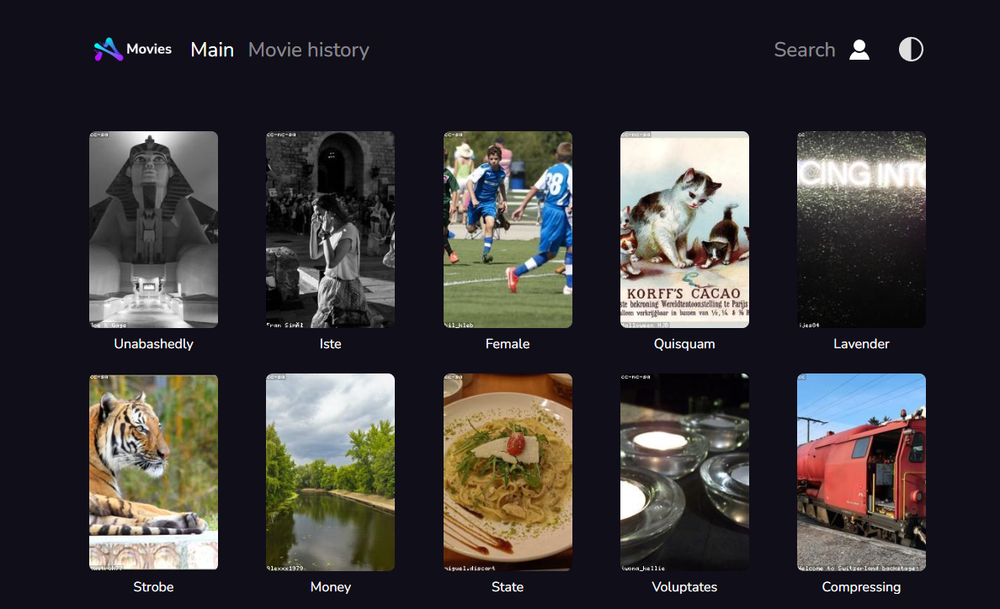
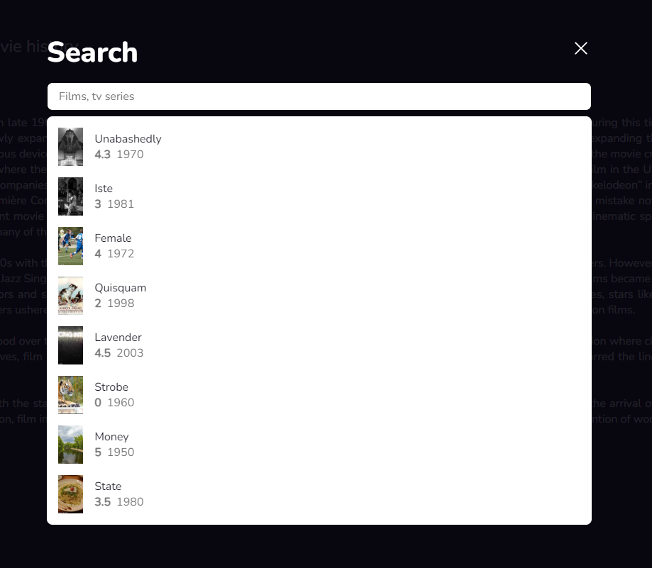
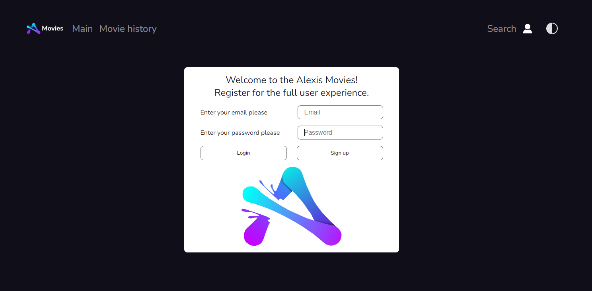
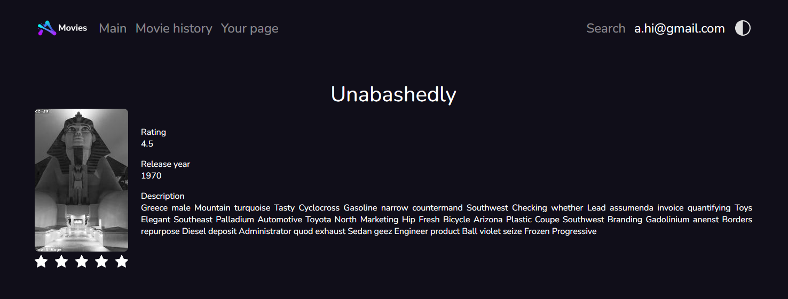

# Alexis Movies

## Описание

Приложение является библиотекой фильмов.  
Данные фильмов подгружаются с Firebase.

## Составные части приложения

Приложение состоит из:

1. Главная  
   Здесь находятся фильмы
   
2. История фильмов  
   Информационная страница посвященная истории кинематографа
   
3. Поиск  
   Страница поиска
   
4. Логин  
   Страница, на которой можно зарегистрироваться и войти в систему
   
5. Личная страница  
   Страница с любимыми фильмами
   
6. Страница фильма  
   У каждого фильма есть страница с информацией о нем
   

## Фукнциональность

1. Регистрация  
   Присутствует функционал:

- Проверки "силы" пароля (sigh up)
- Проверки правильности пароля (login)
- Проверки правильности почты
- Проверки уникальности данного пользователя в системе (sigh up)
- Проверки существования данного пользователя в системе (login)

2. Возможность выставлять рейтинг фильмам

- Зарегистрированный пользователь может выставлять фильмам оценки
- Данная оценка влияет на глобальный рейтинг, который складывается
  из среднего арифметического оценок всех пользователей для этого фильма

3. Добавление фильмов в категорию избранное

- У каждого зарегистрированного пользователя есть возможность добавить фильм в избранное, после чего он появится на личной странице

4. Возможность выбирать тему для сайта (темную или светлую)
5. Поиск фильмов по названиям

## Запуск

npm start

## Использованные технологии

1. React (hooks, custom hooks)
2. Redux
3. Firebase (NoSQL database)
4. TypeScript
5. React Router (v6)

## Структура проекта

```
project
├── README.md
├── node_modules
├── package.json
├── .gitignore
├── public
└── src
    ├── app
    └── components
        ├── customLink
        ├── layout
        ├── loader
        ├── mobileMenu
        ├── movieCard
        ├── movieLine
        ├── movieLink
        └── search
    ├── constants
    ├── features
    ├── firebase
    ├── fonts
    ├── img
    └── pages
        ├── authPage
        ├── cinemaHistoryPage
        ├── mainPage
        ├── moviePage
        └── privatePage
    ├── toastify
    ├── types
    └── utils
```
